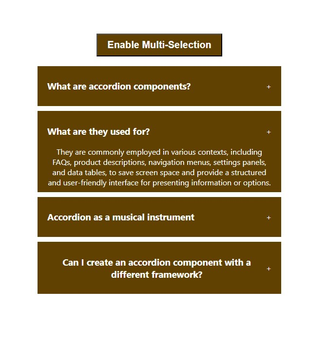
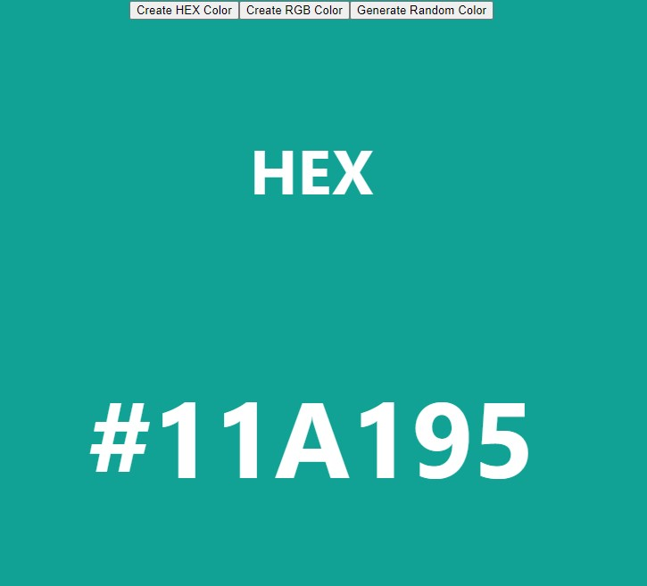

# Build 25 React Projects

## Table of contents

- [Overview](#overview)
  - [The challenge](#the-challenge)
  - [Screenshot](#screenshot)
  - [Links](#links)
- [My process](#my-process)
  - [Built with](#built-with)
  - [What I learned](#what-i-learned)
  - [Continued development](#continued-development)
- [Author](#author)

## Overview

### The challenge

Users should be able to:

#### Accordian

- When question is clicked, an answer is revealed.
- When Enable buttpn is clicked, multiple questions can be opened

#### Random Color

- Click "Create HEX Color" to switch to HEX color style setting
- Click "Create RGB Color" to switch to RGB color style setting
- Click "Generate Random Color" to randomly generate a color in color style setting

### Screenshots

 

### Links

- Live Site URL: [View](https://build25reactprojects.netlify.app/)

## My process

#### Accordian

- The 'Accordion' React component utilizes the 'useState' hook to manage selected items and enable/disable multi-selection.
- It dynamically renders a list of items fetched from an external data source, each with a toggleable title and content section. Users can switch between two modes: single selection and multi-selection, which are controlled by the 'enableMultiSelection' state.
- In single selection mode, clicking an item's title expands or collapses its content to reveal or hide the answer.
- Conversely, multi-selection mode allows users to toggle the selection status of multiple items simultaneously.
- This component ensures efficient re-rendering based on user interactions, delivering a responsive and interactive experience tailored to the selected mode and items.

#### Random Color

- The RandomColor component in React generates random colors based on user-selected color types (HEX or RGB) using two state variables: typeOfColor and color.
- It includes utility functions, handleCreateRandomHexColor for HEX colors and handleCreateRandomRgbColor for RGB colors, to produce random color values.
- These functions leverage hexadecimal digits or RGB ranges to generate diverse colors.
- The useEffect hook is employed to update the displayed color whenever the typeOfColor state changes, ensuring real-time rendering of the selected color type.
- The component's user interface features buttons for toggling between color types, triggering color generation, and displaying the current color type and value dynamically.

### Built with

- Semantic HTML5 markup
- CSS custom properties
- Mobile-Responsive Design
- JavaScript - Scripting language
- [React](https://reactjs.org/) - JS library

### What I learned

#### Accordian

Learn in the process of order placing functions.

#### Random Color

With this, had atouch on useEffect

### Continued development

maybe use later

## Author

- Website - [Cameron Howze](https://camkol.github.io/)
- Frontend Mentor - [@camkol](https://www.frontendmentor.io/profile/camkol)
- GitHub- [@camkol](https://github.com/camkol)
- LinkedIn - [@cameron-howze](https://www.linkedin.com/in/cameron-howze-28a646109/)
- E-Mail - [cameronhowze4@outlook.com](mailto:cameronhowze4@outlook.com)
